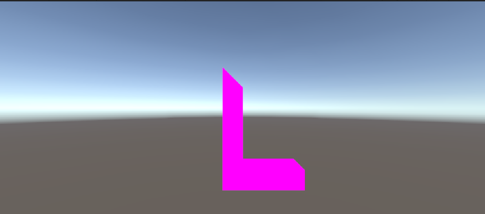

# Computer Graphics

## Overview
In this repository, I have implemented a series of features that demonstrate the principles of computer graphics. The main highlight of the project is the creation of a 3D letter model, which includes vertices, faces, normals, and textures. This serves as a foundation for understanding more complex graphics rendering techniques.

### Technologies Used
Unity 3D, C#

## Features

1. 3D Letter Creation:
- Built a 3D letter model with defined vertices, faces, and normals.
- Applied textures to enhance the visual appearance of the model.

  
2. Line Transformations:
- Implemented functions for placing, rotating, and scaling 3D objects.
- Developed a 3D viewing scene and projection methods to visualize the model effectively.

3. Clipping and Rasterization:
- Incorporated clipping algorithms to manage the visibility of objects within the viewport.
- Utilized Bresenham's line algorithm for efficient line drawing.

4. 2D Texturing:
- Created a 2D texture to be applied to a plane where the 3D model is displayed.
- Enabled the 3D model to rotate around its own axis or another specified origin point.
